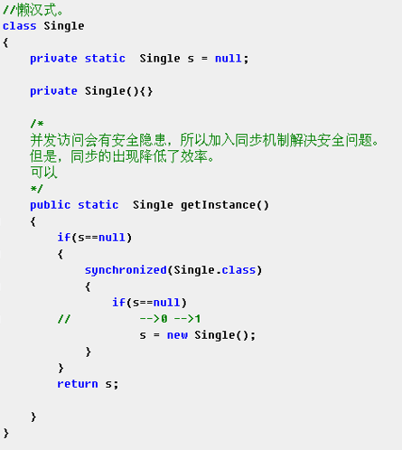

# java多线程

* 多线程概念
* 多线程运行原理
* 创建多线程方式--继承Thread类或实现Runnable接口
* 多线程的栈内存原理
* 线程的状态
* 线程安全问题
* 等待唤醒机制

1.多线程概念

* 进程：正在运行的程序，程序运行时开辟的那一片**内存空间**.
* 线程:进程中的一个**执行单元**,负责进程中程序的运行，一个进程中至少有一个线程(执行单元)，多线程即在一个进程中有多个执行单元. 
* 并发:多线程可以实现多部分程序同时执行.

2.多线程运行原理

* cpu处理程序，通过快速切换线程实现.
* 线程合理使用cpu资源,线程过多会降低效率.

3.创建多线程方式

* --**继承Thread类**(线程任务与线程对象耦合性高)
 + 定义一个类继承Thread类
 + 重写run方法
 + 创建子类对象，即线程对象
 + 调用子类的start方法,开启线程并让线程执行，告诉jvm调用当前线程的run方法.
* 调用run方法和调用start方法的区别?
  + run方法不开启线程,仅是对象调用方法
  + start方法开启线程,并让jvm在开启的线程中执行run方法.
* 继承Thread类的原理
  + 继承Thread类而不直接创建Thread类是因为，创建出的Thread对象的start方法调用的是Thread的run方法，该方法什么都不执行，没有我们需要的执行线程的代码. 
* **实现Runnable接口**(避免单继承局限性,更符合面向对象设计思想，线程对象与线程任务分离，降低耦合性,Runnable接口对线程对象和线程任务进行解耦)
  + 创建类实现Runnable接口,覆盖接口中的run方法
  + 创建实现Runnable接口的类的实例对象
  + 创建Thread类对象，将实现Runnable接口类的实例对象传递给Thread对象的构造函数(线程任务被封装到实现Runnable接口的子类对象中)
  + 调用Thread对象的start方法，开启线程.

4.多线程的栈内存原理及注意点

* 多线程执行时，在栈内存中，每一个线程都有自己所属的栈内存空间,进行方法的压栈和出栈.
* 当执行线程的任务结束了，线程自动在栈内存中释放(包括主线程main).当所有的执行线程都结束了，进程结束.
* Thread.currentThread()获取到当前线程.
* main方法线程名为main,其他线程名为:Thread-n(n为整型).
* main线程出异常结束的是main线程,其他线程不影响(其他线程出异常同理).
* 多次启动同一线程是非法的.
* 多线程任务中通常有循环结构，弥补单线程只能处理一个问题的缺陷.

5.线程状态

6.线程安全问题

* 产生原因:
 + 线程任务操作共享数据
 + 线程任务操作共享数据的代码有多条(运算有多个)
* 解决方法
 + 让同一条线程将共享数据任务代码执行完，其他线程不参与操作，再切换执行权.
 + 使用synchronized(任意对象)标识符{}  锁对象为所选任意对象 
 + 或使用synchronized 函数  锁对象为**this**(固定)
* 同步代码块好处  (同步代码块，解决多线程安全问题)
* 同步代码块弊端 :  降低程序的性能(占用cpu资源)
* 同步的前提 ：
 + **必须保证多个线程使用的是同一个同步锁**
* 多个锁时必须使用synchronized代码块
* 一个锁时使用synchronized函数
* 静态代码(static)函数没有this这个锁对象 ,对象为字节码文件对象 --- 类名.class
* 单例懒汉式多线程并发提高效率的方法: 减小锁的判断次数---通过双重判断

* 同步的另一个弊端：
 + 当线程任务中有多个同步(多个锁)时，同步中嵌套同步，容易产生**死锁**现象.

7.等待唤醒机制

* wait() : 让线程处于等待状态，将线程临时存储到线程池中.
* notify() : 唤醒线程池中**任意一个**等待的线程.
* notifyAll() : 唤醒线程池中所有的等待线程.

* 方法必须使用在同步中，**必须要标识wait,notify,notifyAll所属的锁(监视器)**,同一个锁上的notify只能唤醒被该锁wait的线程.
* 注意 : 为什么wait等方法被定义在Object类中?
  + 因为锁可以被定义为任意对象,任何对象都可以调用Object方法.