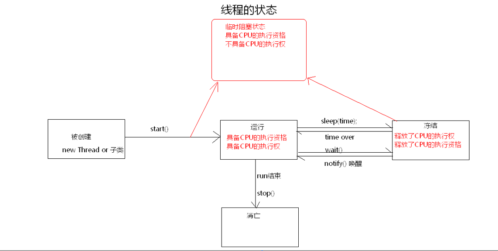

# java多线程

* 多线程概念
* 多线程运行原理
* 创建多线程方式--继承Thread类或实现Runnable接口
* 多线程的栈内存原理
* 线程的状态
* 线程安全问题
* 等待唤醒机制
* 多生产多消费问题
* 多线程细节

1.多线程概念

* 进程：正在运行的程序，程序运行时开辟的那一片**内存空间**.
* 线程:进程中的一个**执行单元**,负责进程中程序的运行，一个进程中至少有一个线程(执行单元)，多线程即在一个进程中有多个执行单元. 
* 并发:多线程可以实现多部分程序同时执行.

2.多线程运行原理

* cpu处理程序，通过快速切换线程实现.
* 线程合理使用cpu资源,线程过多会降低效率.

3.创建多线程方式

* --**继承Thread类**(线程任务与线程对象耦合性高)
 + 定义一个类继承Thread类
 + 重写run方法
 + 创建子类对象，即线程对象
 + 调用子类的start方法,开启线程并让线程执行，告诉jvm调用当前线程的run方法.
* 调用run方法和调用start方法的区别?
  + run方法不开启线程,仅是对象调用方法
  + start方法开启线程,并让jvm在开启的线程中执行run方法.
* 继承Thread类的原理
  + 继承Thread类而不直接创建Thread类是因为，创建出的Thread对象的start方法调用的是Thread的run方法，该方法什么都不执行，没有我们需要的执行线程的代码. 
* **实现Runnable接口**(避免单继承局限性,更符合面向对象设计思想，线程对象与线程任务分离，降低耦合性,Runnable接口对线程对象和线程任务进行解耦)
  + 创建类实现Runnable接口,覆盖接口中的run方法
  + 创建实现Runnable接口的类的实例对象
  + 创建Thread类对象，将实现Runnable接口类的实例对象传递给Thread对象的构造函数(线程任务被封装到实现Runnable接口的子类对象中)
  + 调用Thread对象的start方法，开启线程.

4.多线程的栈内存原理及注意点

* 多线程执行时，在栈内存中，每一个线程都有自己所属的栈内存空间,进行方法的压栈和出栈.
* 当执行线程的任务结束了，线程自动在栈内存中释放(包括主线程main).当所有的执行线程都结束了，进程结束.
* Thread.currentThread()获取到当前线程.
* main方法线程名为main,其他线程默认名为:Thread-n(n为整型).可以通过Thread构造函数，传递线程任务的同时，指定线程名称.
* main线程出异常结束的是main线程,其他线程不影响(其他线程出异常同理).
* 多次启动同一线程是非法的.
* 多线程任务中通常有循环结构，弥补单线程只能处理一个问题的缺陷.

5.线程状态

6.线程安全问题

* 产生原因:
 + 线程任务操作共享数据
 + 线程任务操作共享数据的代码有多条(运算有多个)
* 解决方法
 + 让同一条线程将共享数据任务代码执行完，其他线程不参与操作，再切换执行权.
 + 使用synchronized(任意对象)标识符{}  锁对象为所选任意对象 
 + 或使用synchronized 函数  锁对象为**this**(固定)
* 同步代码块好处  (同步代码块，解决多线程安全问题)
* 同步代码块弊端 :  降低程序的性能(占用cpu资源)
* 同步的前提 ：
 + **必须保证多个线程使用的是同一个同步锁**
* 多个锁时必须使用synchronized代码块
* 一个锁时使用synchronized函数
* 静态代码(static)函数没有this这个锁对象 ,对象为字节码文件对象 --- 类名.class
* 单例懒汉式多线程并发提高效率的方法: 减小锁的判断次数---通过双重判断

* 同步的另一个弊端：
 + 当线程任务中有多个同步(多个锁)时，同步中嵌套同步，容易产生**死锁**现象.

7.等待唤醒机制

* wait() : 让线程处于等待状态，将线程临时存储到线程池中.
* notify() : 唤醒线程池中**任意一个**等待的线程.
* notifyAll() : 唤醒线程池中所有的等待线程.

* 方法必须使用在同步中，**必须要标识wait,notify,notifyAll所属的锁(监视器)**,同一个锁上的notify只能唤醒被该锁wait的线程.
* 注意 : 为什么wait等方法被定义在Object类中?
  + 因为锁可以被定义为任意对象,任何对象都可以调用Object方法.

9.多生产多消费问题

>
	JDK1.5前解决方案 
	问题1 ： 生产了商品没有被消费，或消费了多次
	  解决：让唤醒的线程必须判断标记，用while代替if判断.
	 问题2 ： 使用while后，出现死锁问题
	  while使用后若只换醒一个(生产方唤醒生产方线程)线程，然后判断while之后，会让所有线程等待，出现死锁
	 解决：本方唤醒对方,使用notifyAll唤醒所有线程实现效果.(但是唤醒所有线程(部分线程不需要使用)导致效率低)

JDK1.5后解决方案

	java.util.concurrent.locks--Lock接口解决
	lock() :获取锁  unlock()释放锁
	将旧锁替换成新锁，锁上的监视器方法(Object中的wait,notify,notifyAll)替换成新的监视器方法
	JDK1.5将原有监视器方法封装到了Condition对象中.
	方法对应 : await,singal.singalAll

	//定义锁对象
	private Lock lock = new ReentrantLock(); 
	//获取锁上的Condition对象
	private Condition con = lock.newCondition();
	
	//public static final Object obj = new Object();
	
	public  void setName(String name){
		//获取锁
		lock.lock();
		try
		{
		while(flag)//if改为while判断，必须多判断标记，否侧出线线程问题
		{
			try {
				con.await();//当前线程等待
			} catch (InterruptedException e) {
				// TODO Auto-generated catch block
				e.printStackTrace();
			}
		}
		this.name = name+code;
		code++;
		System.out.println(Thread.currentThread().getName()+"...生产了..."+this.name);
		flag = true;
		con.signalAll();//唤醒所有线程，防止出现死锁
		}
		//释放锁
		finally
		{
			lock.unlock();//防止异常导致锁无法释放
		}
	}

* 解决效率问题
  + 只有一个锁
  + 在一个锁上加多个监视器对象(Condition),唤醒对方线程,减少资源的消耗

>
		
	//定义锁对象
		private Lock lock = new ReentrantLock(); 
		//获取锁上的Condition对象
		private Condition pro = lock.newCondition();//负责生产
		//为了解决唤醒对方线程问题,需在一个锁上装两个监视器对象,提高效率
		private Condition con = lock.newCondition();//负责消费
		
		
		//public static final Object obj = new Object();
		
		public  void setName(String name){
			//获取锁
			lock.lock();
			try
			{
			while(flag)//if改为while判断，必须多判断标记，否侧出线线程问题
			{
				try {
					pro.await();//生产者线程等待
				} catch (InterruptedException e) {
					// TODO Auto-generated catch block
					e.printStackTrace();
				}
			}
			this.name = name+code;
			code++;
			System.out.println(Thread.currentThread().getName()+"...生产了..."+this.name);
			flag = true;
			//消费者唤醒一个
			con.signal();
			//con.signalAll();//唤醒所有线程，防止出现死锁
			}
			//释放锁
			finally
			{
				lock.unlock();//防止异常导致锁无法释放
			}
	}

10.多线程细节

* 在同步中拥有执行权，不一定会执行，必须要拥有友锁
>
	synchronized(obj)
	{	
		wait();//0,1,2
		codes...
	}
	synchronized(obj)
	{
		notifyAll();//3
		codes....
		//不会产生线程问题,执行3线程时，虽然唤醒了所有线程，其他线程处于临时阻塞状态，虽然又有cpu执行权，但是没有锁obj,无法执行线程任务，直到3线程代码执行完，释放锁，其他线程才执行.
	}	

>
	
* wait()和sleep()方法的异同点:
 + 相同 ： 都可以使线程处于冻结状态
 + 不同点 : 
         + 1. sleep必须指定时间,wait可以指定也可以不指定时间.
         + 2. sleep时间到，线程会处于临时阻塞或运行状态,wait如果没有指定时间，必须使用，notify()或notifyAll()唤醒.
         + 3. sleep不一定要定义在同步中，wait必须定义再同步中.
         + 4. 都定义再同步中 线程执行到sleep，不会释放锁(sleep肯定会醒)。线程执行到wait，会释放锁.

* 如何中断线程 :
 + 使用Object类的interrupt,将线程的冻结状态解除，让线程恢复到运行状态(重新具备cpu执行资格),还将收到一个InterruptedException异常,需要在catch中捕获异常，在异常处理中改变标记，让循环结束，以达到中断线程的效果

* 守护线程
 + 后台线程，一般创建的为前台线程.
 + 前台与后台运行时没有区别，结束时有区别 ：
 + 前台线程run方法结束进程结束,后台线程run方法结束结束，或者没有其他前台线程，jvm会自动关闭
 + 方法 ： thread(指定线程).setDaemon()

* 线程的优先级
 + 用数字表示  1-10(数字越大优先级越高)
 + 默认初始优先级是5
 + 方法 setPriority(Thread.MAX_PRIORITY)//设置最大优先级为10,最小为1
* 线程组
  + ThreadGroup,可以在Thread的构造函数中指定线程组
  + 可以对多个同组的线程进行统一操作，默认都属于main线程

* join&yield
 + join() : 等待该线程结束.
 + main线程执行到某一线程的join方法时，会释放执行权,处于临时冻结状态，将执行权切换给其他存活的线程，**切换是随机的**，并不一定切换到那个调用join方法的线程,当指定的线程结束时，主线程才继续执行.
 + yield()  : static方法,临时暂停线程,将执行权释放,让其他线程能获得执行权.
 
* Thread的匿名内部类
>
 	new Thread(
     new Runnable(){
			public void run(){
			System.out.println("runnable run");
		}}
	 ){
			public void run()
			{
				System.out.println("subThread run");//打印这个
			}
	}.start();
	

>
	public class Thread
	{
		private Runnable r;
		Thread(Runnable r)
		{
			this.r = r;
		}
		public void run()
		{
			if(r!=null)
			r.run();
		}
		public void start()
		{
			run();
		}
	}

	Public class SubThread extends Thread
	{
		//重写了父类Thread的run方法,导致Runnable中的run方法不执行
		public void run()
		{
			System.out.println("subThread run");
		}
	}
>
* Thread对象的实现子类，覆盖了Thread类的run方法,覆盖了用Runnable线程任务的方法,故打印的是Thread子类的run方法信息.