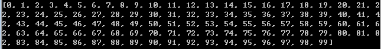

# java趣问

### HashSet是否真的无序(JDK8)
*  HashSet定义：一种没有重复元素的无序集合(既不能保证存储和取出顺序一致，更不能保证自然顺序)。

* 《Thinking in Java》中使用Integer对象的HashSet示例

>
 	import java.util.*;
	public class SetOfInteger{
		public static void main(String[] args){
			Random random = new Random(47);
			Set<Integer> set = new HashSet<Integer>();
			for(int i = 0;i < 10000;i++){
				set.add(random.nextInt(30));
			}
			System.out.println(set);
		}
	}
 >

* 上面例子表示的是在0-29之间的10000个随机数被添加到HashSet中，大量的数据是重复的，然后输出HashSet。
* 按照定义我们应该得到的是类似这样的**无序且不重复**的序列
* **output:**
 **[15, 13, 1, 23, 4, 5, 26, 7, 0, 9, 10, 11, 12, 2, 14, 15, 16, 17, 28, 19, 20, 21, 22, 3, 24, 25, 6, 27, 18, 29]**
* 但是我们得到的却是:
* output: 
**[0, 1, 2, 3, 4, 5, 6, 7, 8, 9, 10, 11, 12, 13, 14, 15, 16, 17, 18, 19, 20, 21, 22, 23, 24, 25, 26, 27, 28, 29]**
* 我们可以看到得到的结果确实是**不重复**的，但是并**不是无序**的，而是**自然升序**的结果。我们可能认为这是巧合，但是我运行许多次都是这个结果。
* 我在想这个真的是巧合吗？我就再写了一个关于**HashSet**的测试类
>
 	import java.util.*;
	public class HashSetDemo{
		public static void main(String[] args){
			Set<Integer> set = new HashSet<Integer>();
			for(int i = 0;i < 100;i++){
				set.add(i);
			}
			System.out.println(set);
		}
	}

* 运行结果 : 
* 
* 原理解释 参见文章----[深入分析——HashSet是否真的无序？（JDK8）](https://maimai.cn/article/detail?fid=1286004471&efid=nj90X3rv5MT7S3dzmDjc1g)